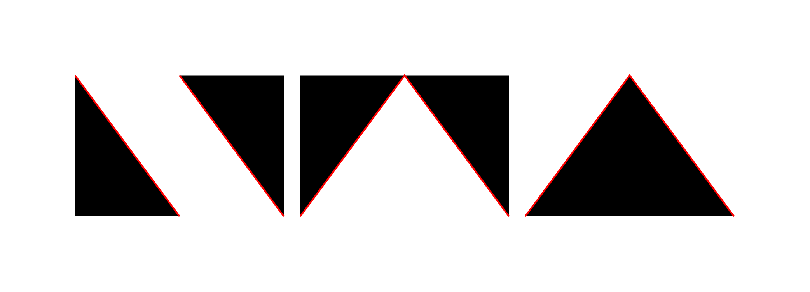

# NWA

[](https://goreportcard.com/report/github.com/B1NARY-GR0UP/nwa)

English | [中文](README_CN.md)

> Mend Your Files



A More Powerful License Header Management Tool

## Install

```shell
go install github.com/B1NARY-GR0UP/nwa@latest
```

Do not have a Go environment? Check the [Docker](#docker---run-nwa-through-docker-for-those-do-not-have-a-go-environment) section.

## Usage

- **[Add](#add---add-license-headers-to-files)**: Add license headers to files
- **[Check](#check---check-license-headers-of-files)**: Check license headers of files
- **[Remove](#remove---remove-licenses-headers-of-files)**: Remove licenses headers of files
- **[Update](#update---update-license-headers-of-files)**: Update license headers of files
- **[Config](#config---edit-files-according-to-the-configuration-file)**: Edit files according to the configuration file
- **[Docker](#docker---run-nwa-through-docker-for-those-do-not-have-a-go-environment)**: Run NWA through docker, for those do not have a Go environment
- **[Examples](https://github.com/rainiring/nwa-examples)**: Examples of NWA functionality  

```shell
Usage:         
  nwa [command]

Common Mode Commands:
  add         add license headers to files
  check       check license headers of files
  remove      remove license headers of files
  update      update license headers of files

Config Mode Commands:
  config      edit the files according to the configuration file

Additional Commands:
  help        Help about any command

Flags:
  -h, --help      help for nwa
  -v, --version   version for nwa

Use "nwa [command] --help" for more information about a command.
```

---

### Add - Add license headers to files

- **Usage**

```shell
nwa add [flags] path...
```

- **Flags**
 
| Short | Long        | Default                            | Description        |
|-------|-------------|------------------------------------|--------------------|
| -c    | --copyright | `<COPYRIGHT HOLDER>`               | copyright holder   |
| -l    | --license   | `apache`                           | license type       |
| -m    | --mute      | `false` (unspecified)              | mute mode          |
| -s    | --skip      | `[]`                               | skip file path     |
| -t    | --tmpl      | `""`                               | template file path |
| -y    | --year      | `time.Now().Year()` (Current Year) | copyright year     |
| -h    | --help      | null                               | help for add       |

- **Example**

```shell
nwa add -l apache -c "RHINE LAB.LLC." -y 2077 ./server ./utils/bufferpool
```

Refer to [nwa-examples](https://github.com/rainiring/nwa-examples) for more examples.

---

### Check - Check license headers of files

- **Usage**

```shell
nwa check [flags] path...
```

- **Flags**

| Short | Long        | Default                            | Description        |
|-------|-------------|------------------------------------|--------------------|
| -c    | --copyright | `<COPYRIGHT HOLDER>`               | copyright holder   |
| -l    | --license   | `apache`                           | license type       |
| -m    | --mute      | `false` (unspecified)              | mute mode          |
| -s    | --skip      | `[]`                               | skip file path     |
| -t    | --tmpl      | `""`                               | template file path |
| -y    | --year      | `time.Now().Year()` (Current Year) | copyright year     |
| -h    | --help      | null                               | help for check     |

**NOTE: Do not use --mute (-m) flag with check command.**

- **Example**

```shell
nwa check --tmpl tmpl.txt ./client
```

Refer to [nwa-examples](https://github.com/rainiring/nwa-examples) for more examples.

---

### Remove - Remove licenses headers of files

- **Usage**

```shell
nwa remove [flags] path...
```

- **Flags**

| Short | Long        | Default                            | Description        |
|-------|-------------|------------------------------------|--------------------|
| -c    | --copyright | `<COPYRIGHT HOLDER>`               | copyright holder   |
| -l    | --license   | `apache`                           | license type       |
| -m    | --mute      | `false` (unspecified)              | mute mode          |
| -s    | --skip      | `[]`                               | skip file path     |
| -t    | --tmpl      | `""`                               | template file path |
| -y    | --year      | `time.Now().Year()` (Current Year) | copyright year     |
| -h    | --help      | null                               | help for remove    |

- **Example**

```shell
nwa remove -l mit -c "RHINE LAB.LLC." -s **.py pkg
```

Refer to [nwa-examples](https://github.com/rainiring/nwa-examples) for more examples.

---

### Update - Update license headers of files

- **Usage**

```shell
nwa update [flags] path...
```

**NOTE: Update identifies the content before the first blank line as a license header; If your file does not meet the requirements, please use `remove` + `add` command.**

- **Flags**

| Short | Long        | Default                            | Description        |
|-------|-------------|------------------------------------|--------------------|
| -c    | --copyright | `<COPYRIGHT HOLDER>`               | copyright holder   |
| -l    | --license   | `apache`                           | license type       |
| -m    | --mute      | `false` (unspecified)              | mute mode          |
| -s    | --skip      | `[]`                               | skip file path     |
| -t    | --tmpl      | `""`                               | template file path |
| -y    | --year      | `time.Now().Year()` (Current Year) | copyright year     |
| -h    | --help      | null                               | help for update    |

- **Example**

```shell
nwa update -l apache -c "BINARY Members" .
```

Refer to [nwa-examples](https://github.com/rainiring/nwa-examples) for more examples.

---

### Config - Edit files according to the configuration file

- **Usage**

```shell
nwa config [flags] path
```

**NOTE: Path is the configuration file path.**

- **Flags**

| Short | Long        | Default                            | Description     |
|-------|-------------|------------------------------------|-----------------|
| -h    | --help      | null                               | help for config |


**NOTE: If some configuration are not configured, the default configuration will be used.**

- **Example**

```shell
nwa config config.yaml
```

Refer to [nwa-examples](https://github.com/rainiring/nwa-examples) for more examples.

- **Sample Configuration file**

**NOTE: If you set the `tmpl` field, the `holder`, `year`, and `license` fields will be ignored.**
 
```yaml
nwa:
  cmd: "add"                        # Default: "add" Optional: "add", "check", "remove", "update" 
  holder: "RHINE LAB.LLC."          # Default: "<COPYRIGHT HOLDER>"
  year: "2077"                      # Default: Current Year
  license: "apache"                 # Default: "apache"
  mute: false                       # Default: false (unspecified)
  path: ["server", "client", "pkg"] # Default: []
  skip: ["**.py"]                   # Default: []
  tmpl: "nwa.txt"                   # Default: ""                                                       
```

- **Sample Template File**

```text
// Copyright 2077 RHINE LAB.LLC.
//
// Licensed under the Apache License, Version 2.0 (the "License");
// you may not use this file except in compliance with the License.
// You may obtain a copy of the License at
//
//     http://www.apache.org/licenses/LICENSE-2.0
//
// Unless required by applicable law or agreed to in writing, software
// distributed under the License is distributed on an "AS IS" BASIS,
// WITHOUT WARRANTIES OR CONDITIONS OF ANY KIND, either express or implied.
// See the License for the specific language governing permissions and
// limitations under the License.
//
```

### Docker - Run NWA through docker, for those do not have a Go environment

- **Install**

Install the nwa docker image directly

EXAMPLE:

```shell
docker pull ghcr.io/b1nary-gr0up/nwa:main
```

OR

Build it from source

EXAMPLE:

```shell
docker build -t ghcr.io/b1nary-gr0up/nwa:main .
```

- **Verify if it can work correctly**

EXAMPLE:

```shell
docker run -it ghcr.io/b1nary-gr0up/nwa:main --version
```

- **Mount the directory you want NWA to work with to `/src` and use the commands mentions in usage**

EXAMPLE:

```shell
docker run -it -v ${PWD}:/src ghcr.io/b1nary-gr0up/nwa:main add -c "RHINE LAB.LLC." -y 2077 .
```

## Related Projects

- **[nwa-examples](https://github.com/rainiring/nwa-examples)**: Examples of NWA functionality

## Credits

Sincere appreciation to the following repositories that made the development of NWA possible.

- [addlicense](https://github.com/google/addlicense)
- [cobra](https://github.com/spf13/cobra)
- [doublestar](https://github.com/bmatcuk/doublestar)
- [logrus](https://github.com/sirupsen/logrus)
- [viper](https://github.com/spf13/viper)

## License

NWA is distributed under the [Apache License 2.0](./LICENSE). The licenses of third party dependencies of NWA are explained [here](./licenses).

## ECOLOGY

<p align="center">

<br/><br/>
NWA is a Subproject of the <a href="https://github.com/B1NARY-GR0UP">Basic Middleware Service</a>
</p>